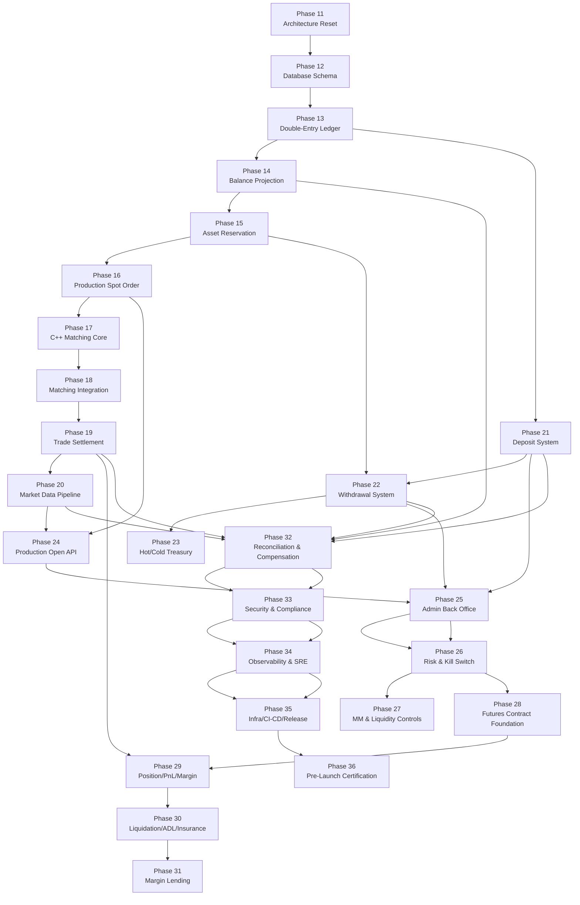

# Phase Dependency Map

## Phase Dependency Graph

## Critical Path

- Phase 12 → 13 → 14 → 15 → 16 → 17 → 18 → 19 → 20
- Phase 21 → 22 → 23
- Phase 24 → 25 → 26 → 27
- Phase 28 → 29 → 30 → 31
- Phase 32 → 33 → 34 → 35 → 36

## Phases That Touch User Funds

Direct or operationally critical funds impact:

- Phase 12
- Phase 13
- Phase 14
- Phase 15
- Phase 16
- Phase 17
- Phase 18
- Phase 19
- Phase 21
- Phase 22
- Phase 23
- Phase 24
- Phase 25
- Phase 26
- Phase 27
- Phase 28
- Phase 29
- Phase 30
- Phase 31
- Phase 32
- Phase 33
- Phase 35
- Phase 36

Primarily indirect but still operationally sensitive:

- Phase 20
- Phase 34

## Critical-Risk Phases

- Phase 12
- Phase 13
- Phase 14
- Phase 15
- Phase 16
- Phase 17
- Phase 18
- Phase 19
- Phase 21
- Phase 22
- Phase 23
- Phase 25
- Phase 26
- Phase 29
- Phase 30
- Phase 31
- Phase 32
- Phase 33
- Phase 36

## Mandatory Human Review Phases

Mandatory human review is required before merge for every runtime phase from Phase 12 through Phase 36.

Reasons:

- funds safety
- external API exposure
- operational control
- security and compliance
- launch gating

## Phases That Cannot Be Parallelized

Implementation must not be parallelized inside the same dependency chain:

- Phase 12 → 13 → 14 → 15 → 16 → 17 → 18 → 19 → 20
- Phase 21 → 22 → 23
- Phase 24 → 25 → 26 → 27
- Phase 28 → 29 → 30 → 31
- Phase 32 → 33 → 34 → 35 → 36

Additional non-parallelization rules:

- Phase 13 must not start runtime implementation before Phase 12 schema is reviewed
- Phase 15 must not start before Phase 14 projection and reconciliation boundaries are reviewed
- Phase 19 must not start before Phase 18 integration is reviewed
- Phase 22 must not start before Phase 21 deposit-side wallet baseline is reviewed
- Phase 29 must not start before Phase 28 contract definitions are reviewed
- Phase 36 must not start as a launch claim until all prior gates pass

## Work That Can Be Parallelized

The following can be parallelized as documentation, UI, or ops-preparation work only, not as premature runtime completion:

- drafting or refining docs in `docs/phases/`
- runbook, dashboard, and incident-document preparation for Phase 34
- legal, support, SLA, and listing-policy draft preparation for Phase 36
- read-only UI preparation for future admin or wallet screens, as long as no runtime claims are made
- API documentation drafting after contracts stabilize
- market-maker onboarding documentation and ops checklists

Runtime code must still respect the dependency graph above.
