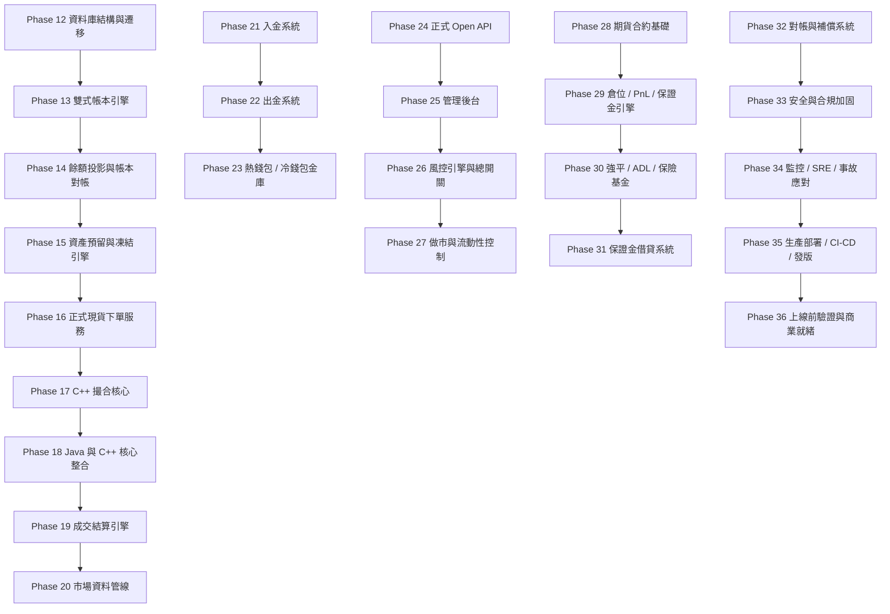

# Phase 依賴圖

這份文件只說清楚一件事：哪幾章一定要先後順序做，哪幾章可以先準備文件或營運材料。

## 依賴關係圖

## 關鍵路徑

- 正式現貨核心：12 → 13 → 14 → 15 → 16 → 17 → 18 → 19 → 20
- 錢包路徑：21 → 22 → 23
- API / 管理 / 風控 / 流動性：24 → 25 → 26 → 27
- 合約與保證金：28 → 29 → 30 → 31
- 對帳 / 安全 / 部署 / 上線：32 → 33 → 34 → 35 → 36

## 不能亂跳的地方

- 12 到 20 是正式交易主線，不能跳到後面再回頭補。
- 21 到 23 需要前面的資金底座。
- 29 到 31 需要前面的合約與保證金規則。
- 32 到 36 需要前面的大多數核心完成。

## 會碰到用戶資金的章節

- 12 到 23、26、29 到 32、36。

## 必須人工審核的章節

- 12 到 36 全部都要人工審核。

## 可以先平行準備的部分

- 文件整理
- 產品文案
- UI 草圖
- 營運流程
- 監控與告警文件
- 法務與客服文件
